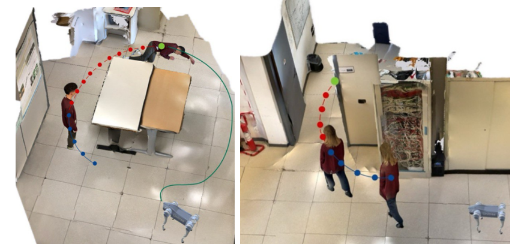

# Robotic-Dog for Elderly Assistance via Transformer-based Fall Detection and Motion Prediction
AI-powered legged robotic platform for real-time fall detection and motion prediction in cluttered environments. 

 

## Code
Coming soon...

## Installation
Coming soon...

## Data
Coming soon...

## ROS
Coming soon...