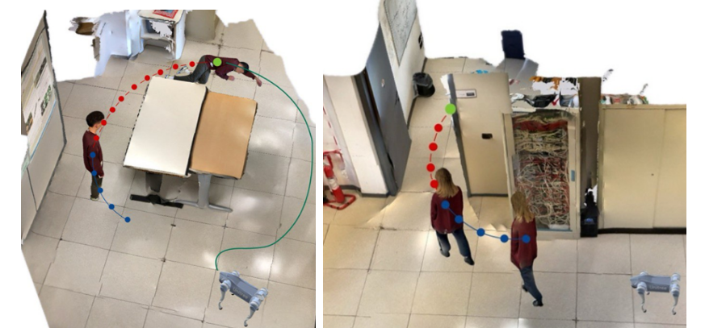

# WatchDog

## AI-Powered Robotic Dog for Elderly Assistance via Transformer-based Fall Detection and Motion Prediction

<p align="center">
  
</p>

---

## Overview

WatchDog is an AI-powered legged robotic platform designed for **real-time fall detection** and **motion prediction** in cluttered home environments. Our system combines state-of-the-art transformer architectures with agile quadruped locomotion to provide proactive elderly care.

---

## Key Features

- **Real-time Fall Detection** - Transformer-based model for accurate fall prediction
- **Motion Prediction** - Anticipate movements to prevent accidents before they occur
- **Cluttered Environment Navigation** - Robust locomotion in realistic home settings
- **ROS Integration** - Full Robot Operating System support for deployment

---

## Resources

| Resource | Link |
|----------|------|
| 📄 **Paper** | [Coming Soon](#) |
| 💻 **Code** | [GitHub Repository](https://github.com/YOUR-USERNAME/WatchDog) |
| 📊 **Dataset** | [Coming Soon](#) |

---

## Quick Start

```bash
# Clone the repository
git clone https://github.com/YOUR-USERNAME/WatchDog.git
cd WatchDog

# Installation instructions coming soon
```

---

## Citation

If you find this work useful, please cite our paper:

```bibtex
@article{watchdog2026,
  title={Robotic-Dog for Elderly Assistance via Transformer-based Fall Detection and Motion Prediction},
  author={Your Name},
  journal={},
  year={2026}
}
```

---

## Contact

For questions or collaborations, please open an issue on [GitHub](https://github.com/YOUR-USERNAME/WatchDog/issues).

---

<p align="center">
  <sub>© 2026 WatchDog Project</sub>
</p>
